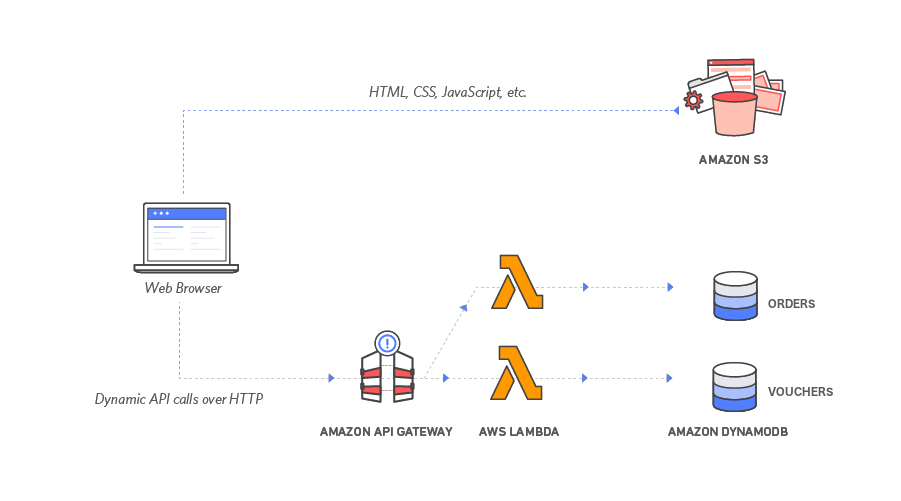
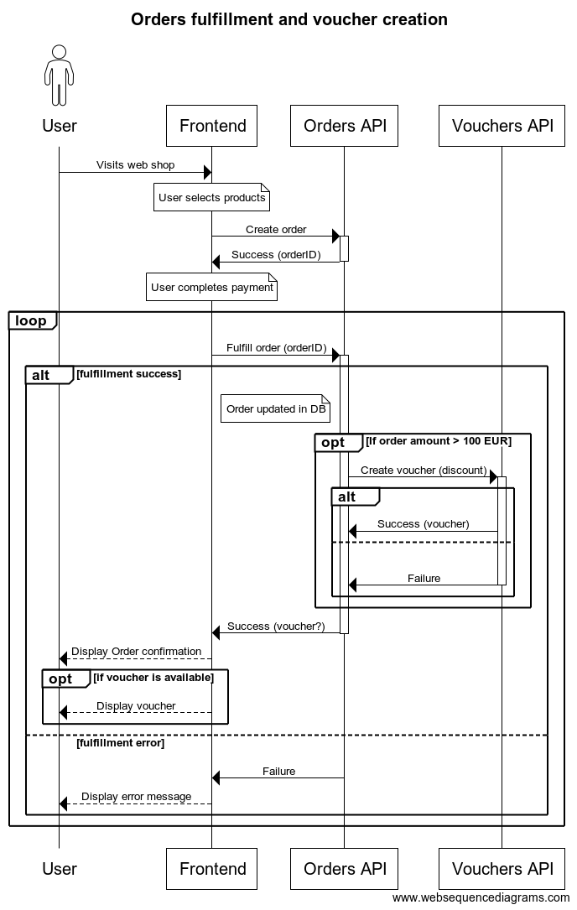

# Distributed System demo
This project demostrates the fulfillment of orders and creation of vouchers for orders that costed more than 100 EUR.

## User stories
AS THE: Customer 
I WANT: To receive a voucher worth 5 euro When I fulfill an order that costs more than 100 euro 
SO THAT: I can save money in my next order. 

AS THE: Engineering Manager 
I WANT: To have independent modules for Orders and Vouchers 
SO THAT: Different teams can have different release cycles and can manage their own deployment pipelines 

## Assumptions (out of scope)
- An order has to be created before it is fulfilled
- Payments are completed before the order is fulfilled
- No inventories have to be updated
- Currency is always in EUR
- No special handling for money is required
- Voucher discount is a fixed amount
- Vouchers can be used only once, no remaining amount is stored
- No user authentication is required

## Application Architecture
The application architecture uses AWS Lambda, Amazon API Gateway, Amazon S3 and Amazon DynamoDB as pictured below:

## Serverless Backend
Amazon DynamoDB (NoSQL) provides a persistence layer where data can be stored by the API's Lambda function. The following tables are used:

### Order
  - orderId: Unique uuid 
  - version: Used for [Optimistic locking](https://docs.aws.amazon.com/amazondynamodb/latest/developerguide/DynamoDBMapper.OptimisticLocking.html) 
  - status: (CREATED or FULFILLED), 
  - amount: Order cost in EUR
  - items: Items information as JSON string

### Voucher
  - voucherId: Unique voucher code
  - discount: Discount amount in EUR
  - status: (DISABLED, READY, USED)

## RESTful API
JavaScript executed in the browser sends and receives data from a public backend API built using Lambda and API Gateway.
  - POST /order (createOrder Lambda)
  - PUT /order (fulfillOrder Lambda)

## Internal Lambda functions
  - createVoucher 

## Sequence diagram
- An error in the voucher creation does not stop the order fulfillment process  
- If an order fails to be fulfilled, no voucher is created.
- The user can retry in case the order fulfillment failed.

